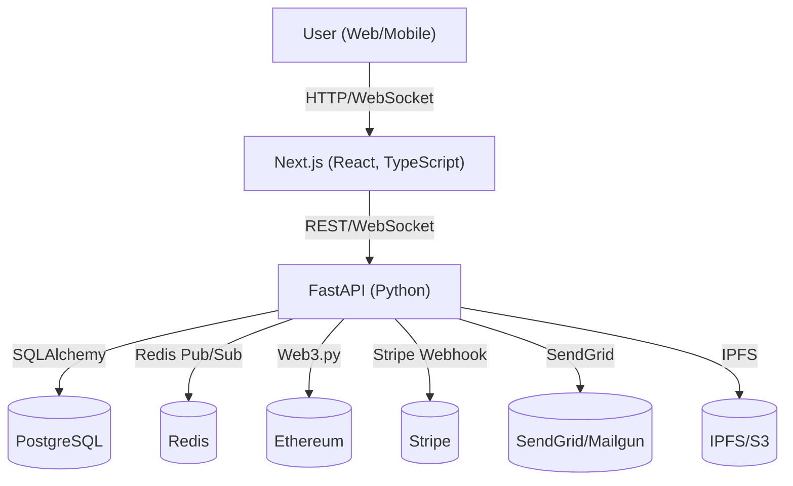

# Decentralized Freelance Marketplace

A production-ready, full-stack platform for decentralized freelance work, featuring smart contract escrow, milestone payments, real-time chat, and robust admin tools.

---

## Architecture Diagram



---

## Features
- User registration, OAuth, 2FA, and role-based access
- Project listings, bidding, and milestone-based escrow
- Smart contract integration (Solidity, Ethereum)
- Real-time chat (WebSocket, Redis)
- Stripe for fiat payments, Ethers.js for crypto
- Admin dashboard, audit logging, and analytics
- Mobile-first, accessible, and PWA-ready UI
- CI/CD, Docker, Kubernetes, Terraform, and monitoring

---

## Setup Instructions

### Prerequisites
- Docker & Docker Compose
- Node.js 18+
- Python 3.10+
- AWS CLI (for Terraform)
- kubectl (for Kubernetes)

### Local Development
1. **Clone the repo:**
   ```sh
   git clone <your-repo-url>
   cd Decentralised-Freelance-Marketplace
   ```
2. **Start backend:**
   ```sh
   cd backend
   pip install -r requirements.txt
   uvicorn app.main:app --reload
   ```
3. **Start frontend:**
   ```sh
   cd frontend
   npm install
   npm run dev
   ```
4. **Start contracts (Hardhat):**
   ```sh
   cd contracts
   npm install
   npx hardhat node
   npx hardhat test
   ```

### Production Deployment
- Use the provided Dockerfiles and Kubernetes manifests (`k8s-*.yaml`).
- Provision cloud resources with Terraform (`infra/main.tf`).
- Configure secrets (DB, Redis, Stripe, SendGrid, etc.) in your cloud/K8s environment.
- Use GitHub Actions for CI/CD.

---

## API Documentation
- **OpenAPI/Swagger:** [http://localhost:8000/docs](http://localhost:8000/docs)
- **Postman Collection:** See `docs/postman_collection.json`

---

## Contributing
- Fork the repo and create a feature branch
- Write tests for new features
- Open a pull request with a clear description

---

## License
MIT 