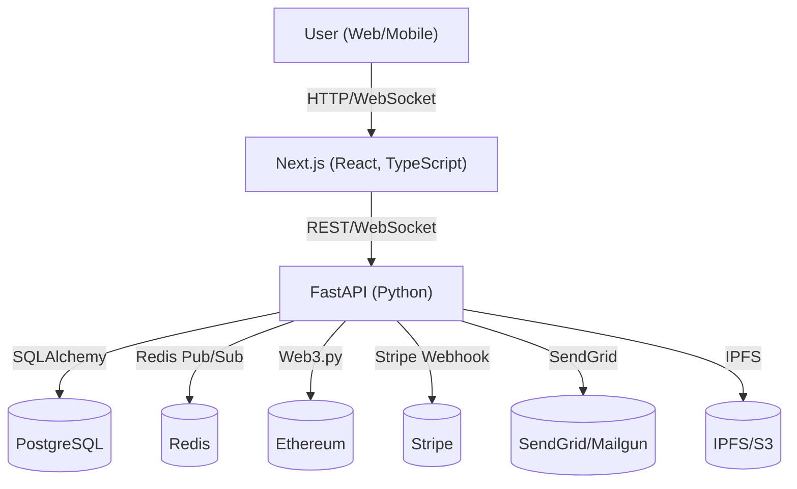

# CraftNexus - Decentralized Freelance Marketplace

A premium decentralized marketplace connecting skilled freelancers with clients worldwide. Built with production-ready architecture featuring smart contract escrow, milestone payments, real-time collaboration, and professional excellence in every detail.

---

## Architecture Diagram



---

## Features
- User registration, OAuth, 2FA, and role-based access
- Project listings, bidding, and milestone-based escrow
- Smart contract integration (Solidity, Ethereum)
- Real-time chat (WebSocket, Redis)
- Stripe for fiat payments, Ethers.js for crypto
- Admin dashboard, audit logging, and analytics
- Mobile-first, accessible, and PWA-ready UI
- CI/CD, Docker, Kubernetes, Terraform, and monitoring

---

## Setup Instructions

### Prerequisites
- Docker & Docker Compose
- Node.js 18+
- Python 3.10+
- AWS CLI (for Terraform)
- kubectl (for Kubernetes)

### Local Development
1. **Clone the repo:**
   ```sh
   git clone <your-repo-url>
   cd Decentralised-Freelance-Marketplace
   ```
2. **Start backend:**
   ```sh
   cd backend
   pip install -r requirements.txt
   uvicorn app.main:app --reload
   ```
3. **Start frontend:**
   ```sh
   cd frontend
   npm install
   npm run dev
   ```
4. **Start contracts (Hardhat):**
   ```sh
   cd contracts
   npm install
   npx hardhat node
   npx hardhat test
   ```

### Production Deployment
- Use the provided Dockerfiles and Kubernetes manifests (`k8s-*.yaml`).
- Provision cloud resources with Terraform (`infra/main.tf`).
- Configure secrets (DB, Redis, Stripe, SendGrid, etc.) in your cloud/K8s environment.
- Use GitHub Actions for CI/CD.

---

## Database Migrations

This project uses **Alembic** for database schema migrations with PostgreSQL.

### Running Migrations

1. **Apply all pending migrations:**
   ```sh
   cd backend
   alembic upgrade head
   ```

2. **Check current migration version:**
   ```sh
   alembic current
   ```

3. **View migration history:**
   ```sh
   alembic history
   ```

### Creating New Migrations

When you add or modify SQLAlchemy models, create a new migration:

1. **Auto-generate migration from model changes:**
   ```sh
   alembic revision --autogenerate -m "Add new column to users table"
   ```

2. **Create empty migration (for manual SQL):**
   ```sh
   alembic revision -m "Add custom index"
   ```

3. **Edit the generated file** in `backend/alembic/versions/`

4. **Apply the migration:**
   ```sh
   alembic upgrade head
   ```

### Common Migration Scenarios

**Adding a column:**
```python
def upgrade() -> None:
    op.execute("""
        ALTER TABLE marketplace.your_table 
        ADD COLUMN IF NOT EXISTS new_column VARCHAR(255) DEFAULT 'value';
    """)

def downgrade() -> None:
    op.execute("""
        ALTER TABLE marketplace.your_table 
        DROP COLUMN IF EXISTS new_column;
    """)
```

**Adding an index:**
```python
def upgrade() -> None:
    op.create_index('ix_users_email', 'users', ['email'], schema='marketplace')

def downgrade() -> None:
    op.drop_index('ix_users_email', table_name='users', schema='marketplace')
```

### Troubleshooting

- **Column does not exist error**: Run `alembic upgrade head` to apply missing migrations
- **Migration out of sync**: Check `alembic current` and compare with `alembic history`
- **Rollback last migration**: `alembic downgrade -1`
- **Reset to specific version**: `alembic downgrade <revision_id>`

---

## API Documentation
- **OpenAPI/Swagger:** [http://localhost:8000/docs](http://localhost:8000/docs)
- **Postman Collection:** See `docs/postman_collection.json`

---

## Contributing
- Fork the repo and create a feature branch
- Write tests for new features
- Open a pull request with a clear description

---

## License
MIT 